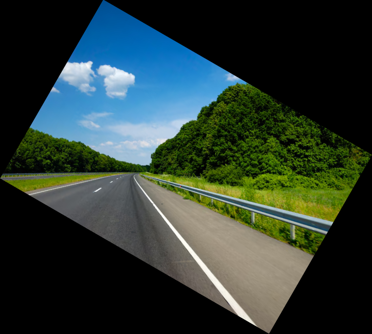
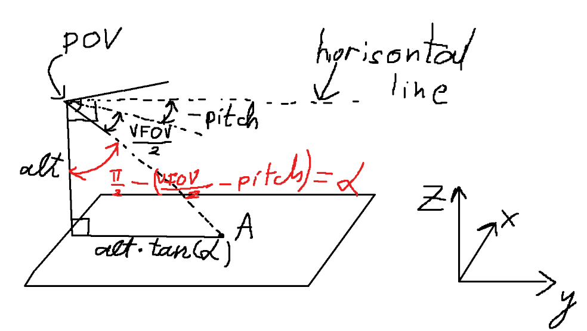
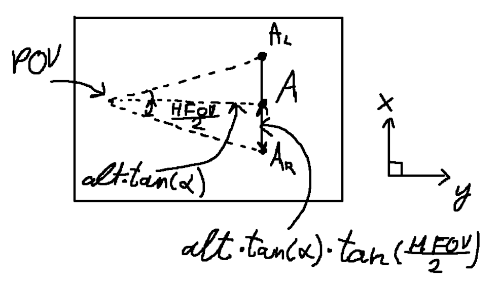
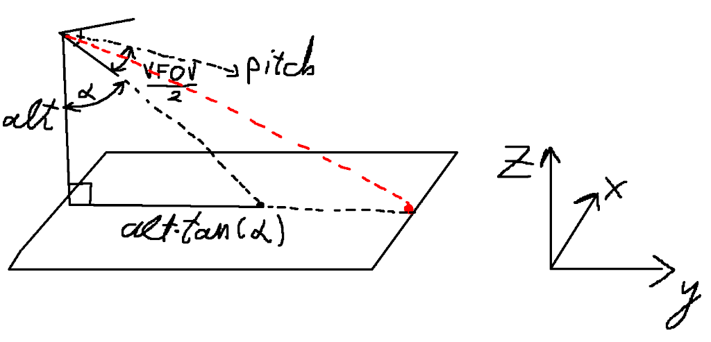
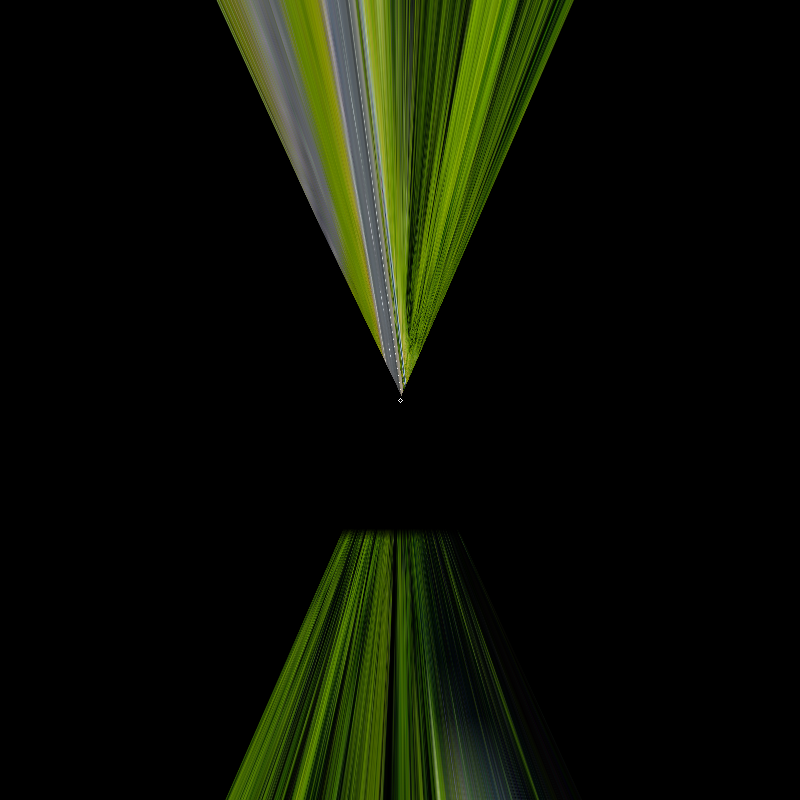
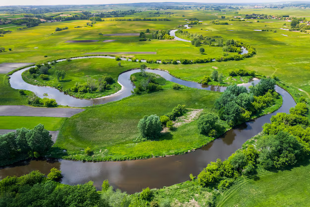
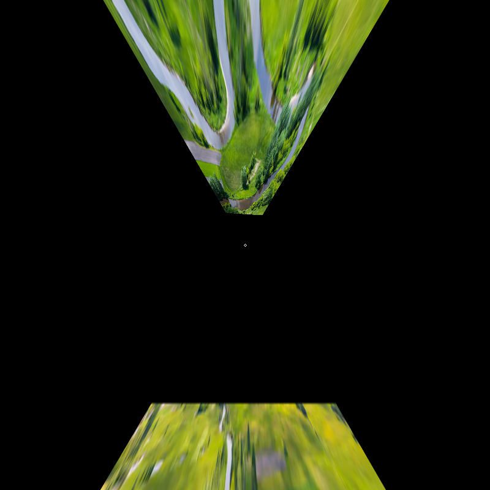
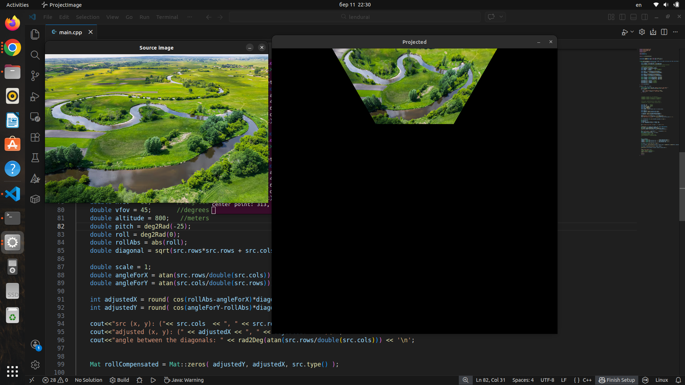

# Test task 1

## Quick start

(Tested, run and developed on Ubuntu 22.04)

To start open the directory of this file and run the following commands:

Install minimal prerequisites

`sudo apt update && sudo apt install -y cmake g++ wget unzip`

Download and unpack sources

`wget -O opencv.zip https://github.com/opencv/opencv/archive/4.x.zip `

`unzip opencv.zip`

Create build directory

`mkdir -p build && cd build`

Configure

`cmake  ../opencv-4.x`

Build

`cmake --build .`

Process of building the openCV library may take some time.

Now get up the directory

`cd ..`

And run

`make` 

After building the project there will be executable called `ProjectImage` created.

To use it run in the command line

`./ProjectImage <filename>`

If the constants(FOVs, angles and altitude) need to be changed, the only way is to open `main.cpp` file and change them.

## Implementation

No code was AI generated as well as the solution itself

The whole algorithm of projecting the image can be devided into several stages. It's made in order to simplify the process of transforming the image around every axis of rotation and projecting it onto the map.

The whole idea is to:

1. Rotate the image in the direction counter to the roll to make the horizon flat.

   

   
2. Fix the HFOV and VFOV because now they are different. We can fix them by using next transformation:

   `newHFOV = HFOV*cos(roll) + VFOV*sin(roll)`
   `newVFOV = VFOV*cos(roll) + HFOV*sin(roll)`

   You can easily justify these formulas by imagining the roll to be 90 degrees, then the vfov will become hfov and vice versa.(Of course the roll should be made `roll = abs(roll)`before this transformation. But the problem comes with roll > 90 degrees).
3. Now the idea is to project the rotated image according to pitch as if it didn't have any roll. To explain how it's done i would use next diagrams:

   

   I know it's a bit messy but the idea is to project the central point on the bottom of the image to the plane that is altitude meters below the Point Of View. Let's call projected point A. Now let's change the view to look to the scene from the above.

   Now we have both `x` and `y` components of points `AL` and `AR` which are projected points of the bottom corners of the image. We can do just the same with the points higher in the image. But the problem is that we have to choose those points carefully so that they would project in front of our POV (in the positive `y` direction) or wouldn't be in the infinity. That's why I chose the point between the pitch direction and `alpha`. (In the project I called those angles as `lowerAng` and `upperAng`)

   
4. As the result we got projected image but we didn't take yaw into account. For that I will just rotate the projected image around the center point of the ground correcsonding to the yaw angle using simple calculations of rotation matrix. The North direction will be the upwards direction on the screen so it's the `0` degrees direction.
5. And the result is... not that good

   
   settings for this result:
   altitude: 2m,  hfov: 40deg,  vfov: 30deg,  yaw: 0,   roll: -30deg,  pitch: 0.

   As you can see there is a clear problem with my solution. It distorts the image too much. The idea itself and the solution feel correct but I might have made several mistakes during implementation. I tried to debug and find what the problem is, but I couldn't find the root cause, but it probably has something to do with the pair of upper points. The baddly distorted pixels on the bottom of the image are probably the artifact of projection transformation which I tried to fix by cropping the top to the line on 400*sqrt(2) distance, but again it didn't help due to the problem with the projection itself.

   But at least the road itself looks preety much consistent in width =).
6. However the other example shows a bit better result

   Setting for this image are:
   altitude: 50m,  hfov: 60deg,  vfov: 45deg,  yaw: 0,   roll: -2deg,  pitch: -22.

   

   

   Again distorted too much... but during debbuging I got sometimes pretty decent results, but it was just some kind of coisidents, because the math wasn't mathing. But still would like to share with you:

   

   This one looks much better and seems to be much closer to reality, but the altitude is actualy insanely big(800meters) and the math was wrong... but somehow it kinda worked.

   Sorry for giving probably too much information but I wanted to share everything I got.
