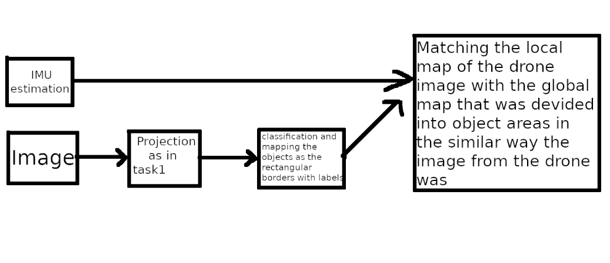
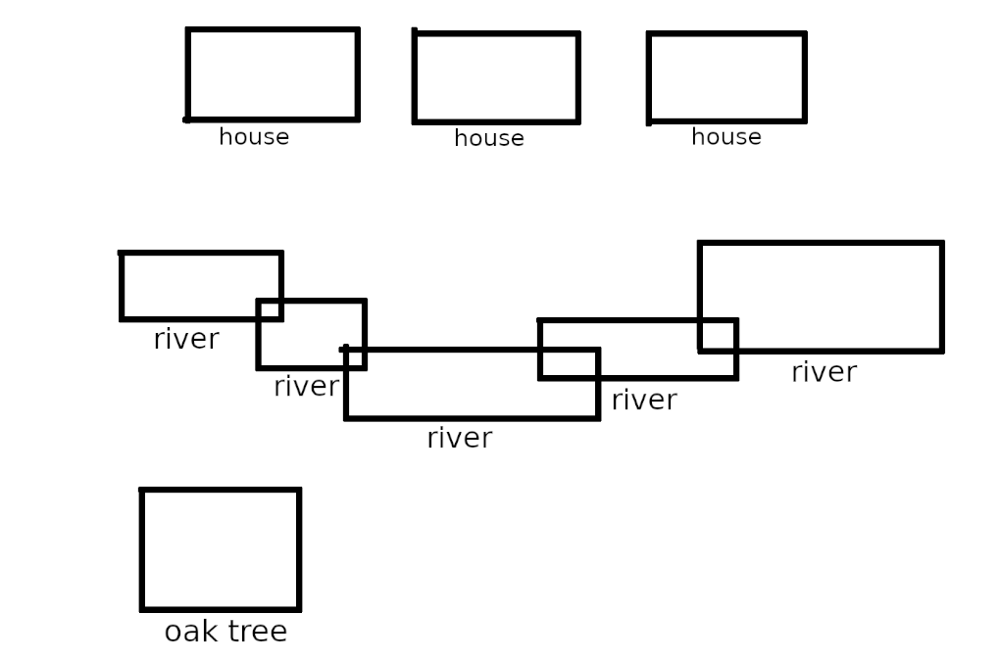
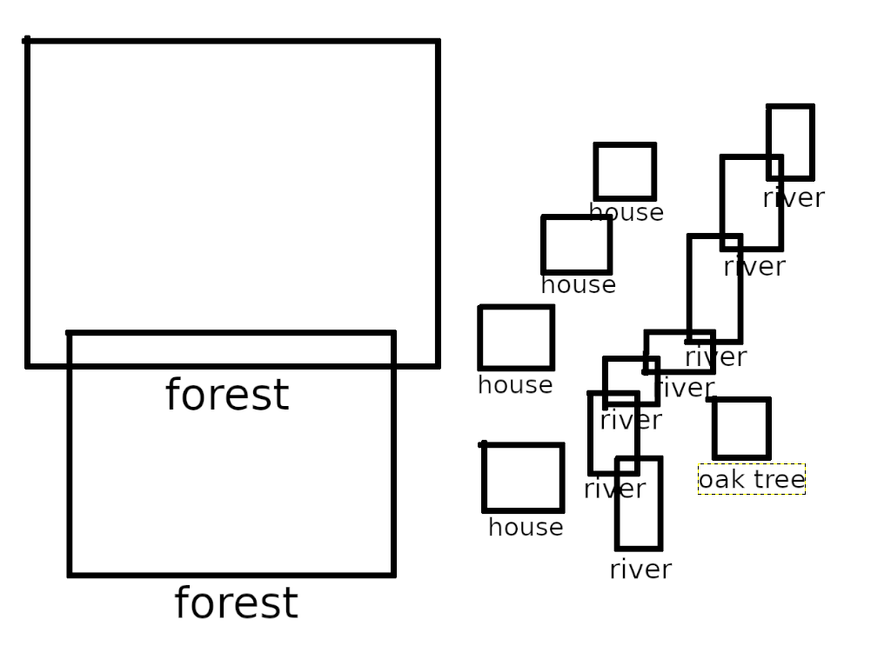

# Test task 2

For this task I didn't get any kind of code but I have an idea on how to solve this problem.

First of all, we can use the working version of the program from the task 1. As the drone flies we can map the world with images. Then for every frame we can use any classifier (YOLO-tiny for example) and map the objects we see(houses, roads, rivers, lakes etc.) onto the local map around the drone just with object borders and labels. Beforehand, the 500sq.m map had to be mapped in the similar way. Next we can use drones' estimation of it's own position to narrow down the region of the search of matches on the global map. And now the hardest part which is trying to get the best match of the objects that the drone sees and the gloabal maps' objects.

Let's imagine the following image to be the classificated and bordered version of the image from the drone

It's purely illustrative, we can store this map as a text file with object borders being represented by two points (left upper and right lower) of the rectangular areas, labels can be stored as text. There is probably a better way to store them, using some data structure but I have no mental capacity left as I'm writting this in the middle of the night at the day I'm sending it to you. (p.s. Oh wait, maybe I got onto something, maybe the better way is to store them in the quadTree data structure, that might be a better way to store and get borders.)

Now let's image there is a global map (the part of it where we estiamate the drone to be by the IMU) that looks something like that:

And for the human the location is obvious (In my sleepy opinion). But for the computer it's not and again I have no mental capacity to think about anything better than brute force matching of the objects areas and their relative positions to one another. With this set of objects it's preety easy, but for a massive image and map that might be computationaly to heavy.

The other solution I could think of is matching the feature maps of the drones' image and global map. But There are a lot of problems like feature consistency over time.

I'm sorry I couldn't make more time for this task and for not so professional language of the explanation. I tried my best to find time but most of my free time I devoted for the first task. I hope you got my idea and hope even more that it wasn't too bad.
